# Main Runtime Full System Flowchart

Date: 2026-04-09
Timezone: Asia/Seoul
Validated Environment: `https://demo-fapi.binance.com`

## 1. Purpose

This document is the full end-to-end map of the current system.

It includes:

- runtime initialization
- trading cycle logic
- order entry and close flow
- protective algo order flow
- pending order reconciliation
- position management
- shared state structure
- validation and evidence flow
- background probe flow
- monitor / stop / background helper flow
- recently fixed connection points
- current residual risks

## 2. System Scope

The system is centered on:

- [main_runtime.py](/c:/next-trade-ver1.0/main_runtime.py)

The most important collaborating modules are:

- [core/account_service.py](/c:/next-trade-ver1.0/core/account_service.py)
- [core/market_data_service.py](/c:/next-trade-ver1.0/core/market_data_service.py)
- [core/indicator_service.py](/c:/next-trade-ver1.0/core/indicator_service.py)
- [core/market_regime_service.py](/c:/next-trade-ver1.0/core/market_regime_service.py)
- [core/signal_engine.py](/c:/next-trade-ver1.0/core/signal_engine.py)
- [core/strategy_registry.py](/c:/next-trade-ver1.0/core/strategy_registry.py)
- [core/allocation_service.py](/c:/next-trade-ver1.0/core/allocation_service.py)
- [core/trade_orchestrator.py](/c:/next-trade-ver1.0/core/trade_orchestrator.py)
- [core/order_executor.py](/c:/next-trade-ver1.0/core/order_executor.py)
- [core/protective_order_manager.py](/c:/next-trade-ver1.0/core/protective_order_manager.py)
- [core/pending_order_manager.py](/c:/next-trade-ver1.0/core/pending_order_manager.py)
- [core/position_manager.py](/c:/next-trade-ver1.0/core/position_manager.py)
- [core/partial_take_profit_manager.py](/c:/next-trade-ver1.0/core/partial_take_profit_manager.py)

Operational helper scripts now in scope:

- [background_supervised_probe.py](/c:/next-trade-ver1.0/background_supervised_probe.py)
- [run_main_runtime_background.py](/c:/next-trade-ver1.0/run_main_runtime_background.py)
- [monitor_main_runtime.py](/c:/next-trade-ver1.0/monitor_main_runtime.py)
- [stop_main_runtime.py](/c:/next-trade-ver1.0/stop_main_runtime.py)

Validation and conclusion documents:

- [MAIN_RUNTIME_LIVE_CHECKLIST.md](/c:/next-trade-ver1.0/MAIN_RUNTIME_LIVE_CHECKLIST.md)
- [MAIN_RUNTIME_GO_NO_GO_CONCLUSION.md](/c:/next-trade-ver1.0/MAIN_RUNTIME_GO_NO_GO_CONCLUSION.md)
- [MAIN_RUNTIME_LOGIC_FLOWCHART.md](/c:/next-trade-ver1.0/MAIN_RUNTIME_LOGIC_FLOWCHART.md)

## 3. Full Architecture Map

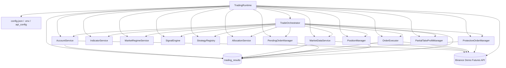

## 4. Initialization Sequence

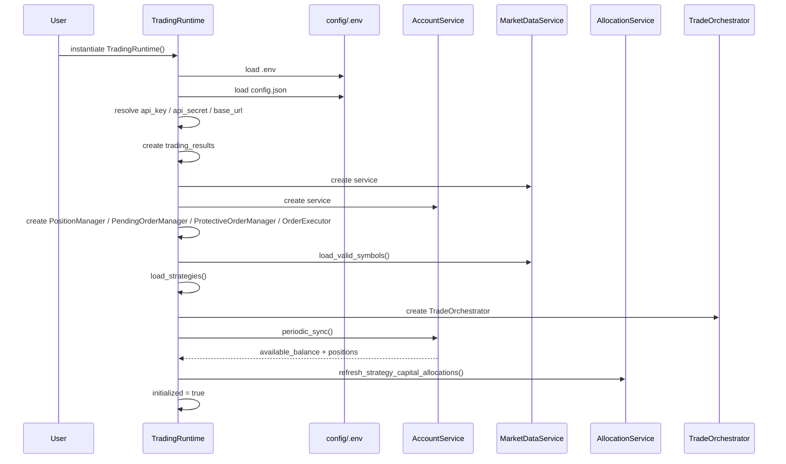

## 5. Initialization Detail

Initialization in [main_runtime.py](/c:/next-trade-ver1.0/main_runtime.py) does this in order:

1. Load `.env`.
2. Initialize shared `trading_results`.
3. Load `config.json`.
4. Resolve credentials and base URL.
5. Load trading configuration values.
6. Create service layer objects.
7. Load valid symbols from exchange metadata plus 24h tickers.
8. Load enabled strategies into runtime state.
9. Construct `TradeOrchestrator`.
10. Run account sync to get actual capital.
11. Initialize allocation state.
12. Mark runtime as initialized.

## 6. Shared State Structure

The central shared state is `trading_results`.

Main keys currently used:

- `strategies`
- `active_positions`
- `pending_trades`
- `closed_trades`
- `real_orders`
- `total_trades`
- `available_balance`
- `market_regime`
- `market_data`
- `system_errors`
- `error_count`
- `last_error`
- `recently_closed_symbols`
- `position_entry_times`
- `partial_take_profit_state`
- `managed_stop_prices`

Important state relationships:

- `position_entry_times` is now unified and shared by runtime, pending-order manager, and position manager.
- `managed_stop_prices` is now written by the protective order manager into `trading_results` as well as local manager state for the validated stop path.

## 7. Main Runtime Loop

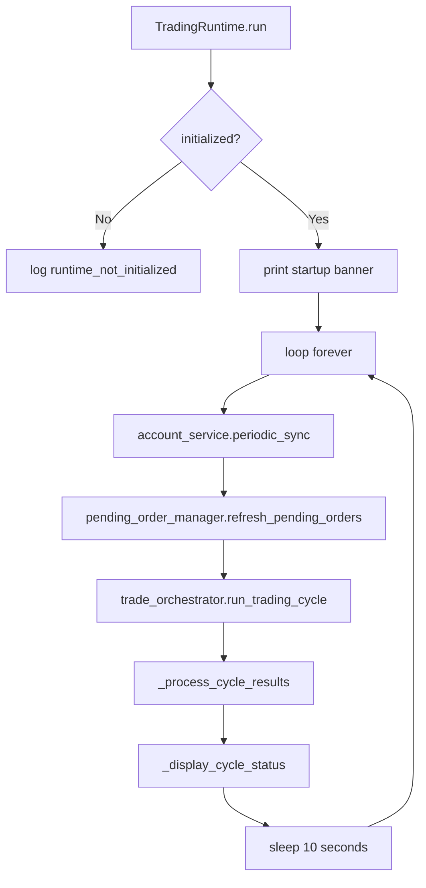

## 8. Trading Cycle Full Flow

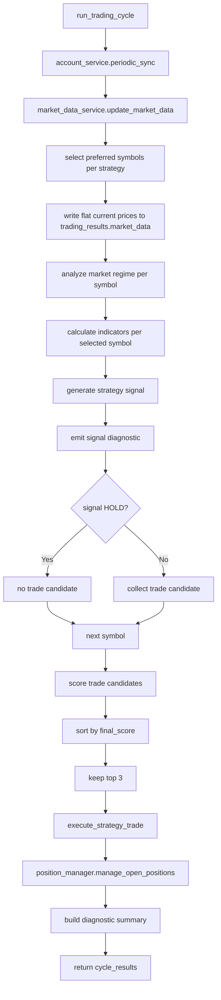

## 9. Market Data and Signal Path

Within [core/trade_orchestrator.py](/c:/next-trade-ver1.0/core/trade_orchestrator.py):

1. Market data is refreshed for the symbol list.
2. The runtime stores simplified prices in `trading_results["market_data"]`.
3. Each symbol gets:
   - regime analysis
   - moving averages
   - EMA set
   - Heikin Ashi analysis
   - fractals
   - RSI
   - ATR
4. `SignalEngine.generate_strategy_signal(...)` is called.
5. Diagnostics are printed and summarized.
6. Only non-`HOLD` signals become trade candidates.

## 10. Strategy Selection and Candidate Ranking

Current runtime strategy set:

- `ma_trend_follow`
- `ema_crossover`

Selection and ranking chain:

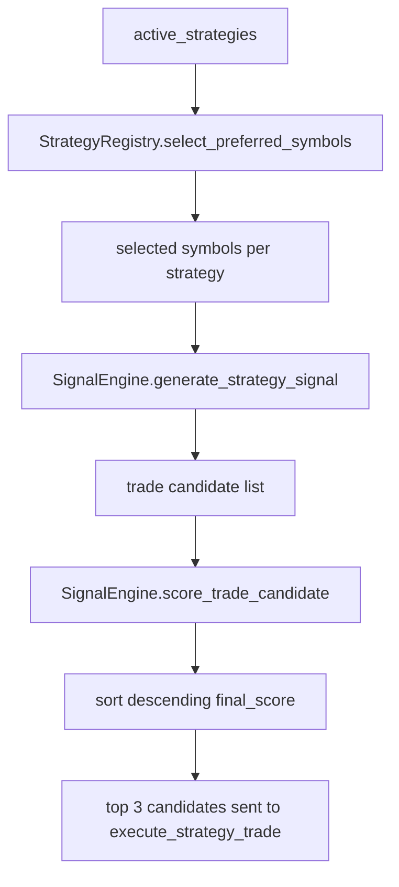

## 11. Entry Execution Path

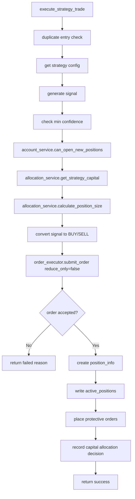

## 12. Order Executor Full Detail

The order path in [core/order_executor.py](/c:/next-trade-ver1.0/core/order_executor.py) is:

1. Resolve symbol metadata from exchange info.
2. Parse:
   - `LOT_SIZE`
   - `MIN_NOTIONAL`
   - `NOTIONAL`
3. Read current price from `trading_results["market_data"]`.
4. Adjust quantity to:
   - min quantity
   - step size
   - min notional
   - available balance
5. Get server time.
6. Build signed market order.
7. Send `POST /fapi/v1/order`.
8. Process response into `real_orders`.

### Entry vs Close

- Entry orders use `reduce_only=false`.
- Exit orders use `reduce_only=true`.
- For `reduce_only`, the executor avoids the same quantity growth logic used for entry orders.

## 13. Protective Algo Order Flow

This path was one of the major corrected items.

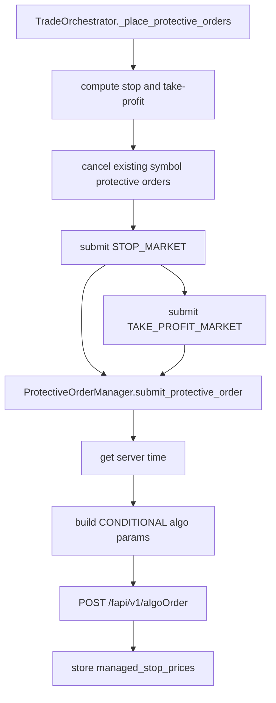

### Current Algo Order Parameters

The validated protective order payload now includes:

- `algoType=CONDITIONAL`
- `symbol`
- `side`
- `type` as `STOP_MARKET` or `TAKE_PROFIT_MARKET`
- `triggerPrice`
- `timeInForce=GTC`
- `closePosition=true`
- `workingType=CONTRACT_PRICE`
- signed `timestamp`

### Open / Cancel Protective Orders

Open orders:

- `GET /fapi/v1/openAlgoOrders`

Cancel orders:

- `DELETE /fapi/v1/algoOrder`

Current field usage:

- `algoId`
- `orderType`
- `triggerPrice`

## 14. Pending Order Reconciliation

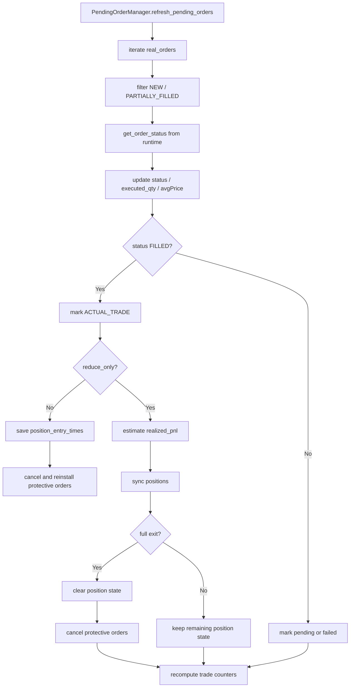

## 15. Position Management Flow

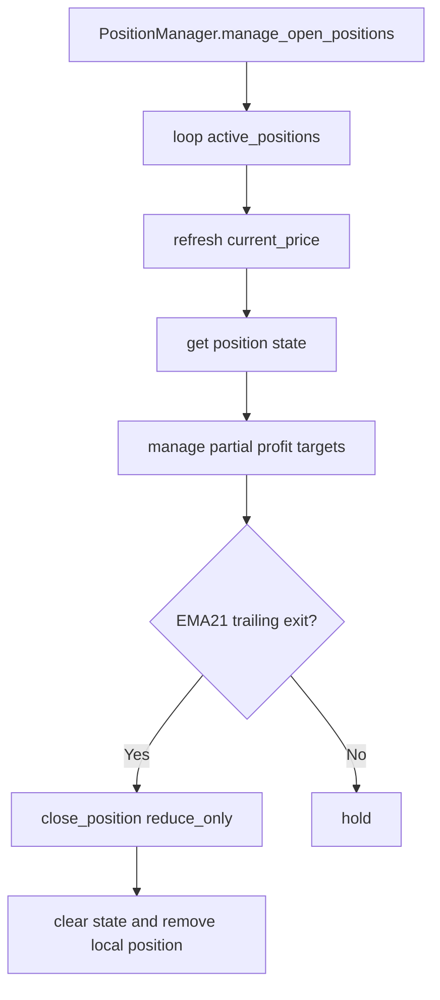

### PositionManager responsibilities

- calculate hold time
- compute unrealized PnL and PnL %
- expose position management state
- manage partial closes
- manage full closes
- manage trailing / EMA21 exit logic
- clear related state after close

## 16. Account Sync Flow

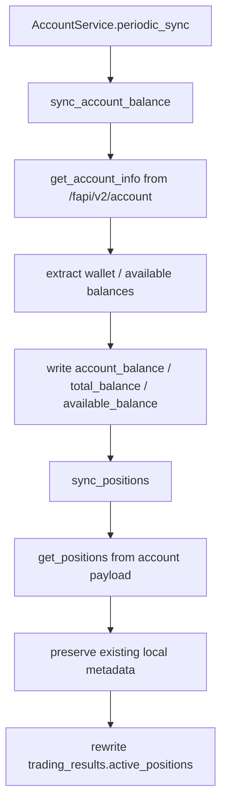

### Preserved local position metadata on sync

When positions are refreshed from exchange, the system tries to preserve:

- `strategy`
- `entry_time`
- `signal_confidence`
- `stop_loss_pct`
- `take_profit_pct`
- `partial_tp_state`
- `managed_stop_price`

## 17. Runtime State File Flow

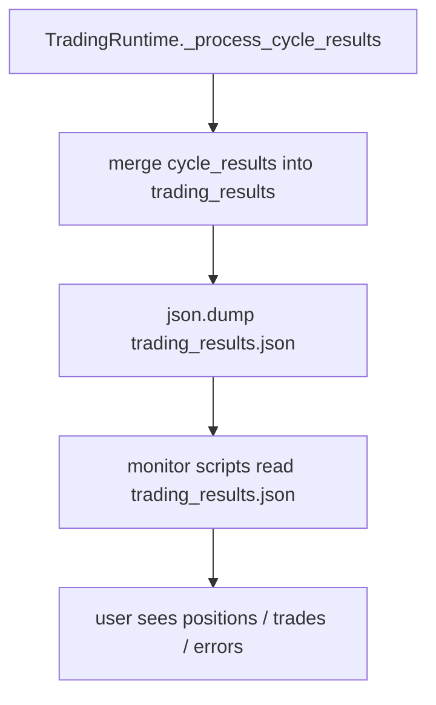

Main state file:

- [trading_results.json](/c:/next-trade-ver1.0/trading_results.json)

## 18. Validation Evidence Flow

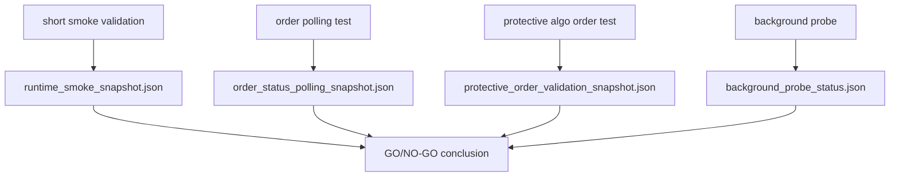

Evidence files:

- [runtime_smoke_snapshot.json](/c:/next-trade-ver1.0/runtime_smoke_snapshot.json)
- [order_status_polling_snapshot.json](/c:/next-trade-ver1.0/order_status_polling_snapshot.json)
- [protective_order_validation_snapshot.json](/c:/next-trade-ver1.0/protective_order_validation_snapshot.json)
- [background_probe_status.json](/c:/next-trade-ver1.0/background_probe_status.json)

## 19. Background Supervised Probe Flow

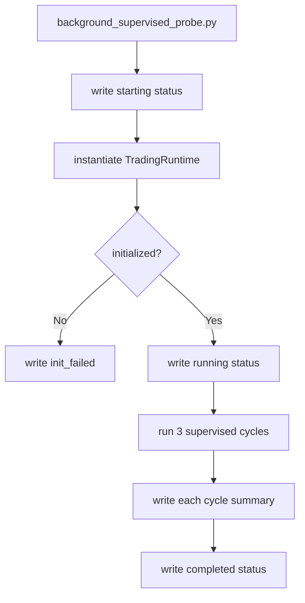

Purpose of the probe:

- validate background execution path
- validate separated process behavior
- validate repeated cycle stability
- produce an explicit machine-readable status file

## 20. Background Operations Tooling Flow

### Start flow

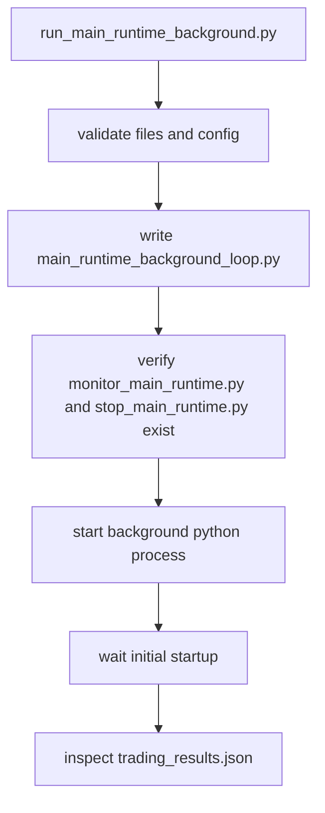

### Monitor flow

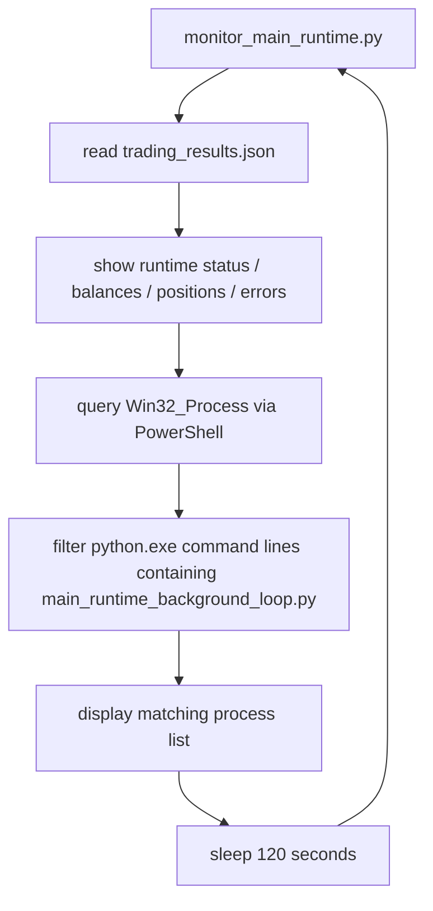

### Stop flow

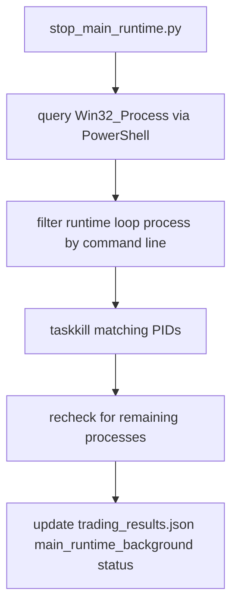

## 21. Recently Fixed Items Included In This Map

### A. Strategy registry compatibility

The missing runtime symbol selection interface in:

- [core/strategy_registry.py](/c:/next-trade-ver1.0/core/strategy_registry.py)

was restored so `TradeOrchestrator` can call:

- `select_preferred_symbols(...)`

### B. Protective order routing

The protective order flow was corrected from the regular order endpoint to the algo order endpoints in:

- [core/protective_order_manager.py](/c:/next-trade-ver1.0/core/protective_order_manager.py)

### C. Shared `position_entry_times`

The entry-time mapping was unified through:

- [main_runtime.py](/c:/next-trade-ver1.0/main_runtime.py)
- [core/pending_order_manager.py](/c:/next-trade-ver1.0/core/pending_order_manager.py)
- [core/position_manager.py](/c:/next-trade-ver1.0/core/position_manager.py)

### D. `update_stop_loss()` algo schema alignment

`update_stop_loss()` now looks for:

- `orderType`
- `algoId`

instead of relying only on legacy:

- `type`
- `orderId`

### E. Operations scripts repair

`tasklist` string matching was replaced for actual command-line-aware process discovery in:

- [monitor_main_runtime.py](/c:/next-trade-ver1.0/monitor_main_runtime.py)
- [stop_main_runtime.py](/c:/next-trade-ver1.0/stop_main_runtime.py)

Missing imports in `stop_main_runtime.py` were also repaired.

## 22. Current Strong Points

- runtime initializes cleanly
- account sync is working
- dynamic symbol loading is working
- known order status polling is working
- protective conditional algo orders are working
- reduce-only close path is working
- short supervised foreground runs are stable
- short background supervised probe is stable
- monitor/stop helper scripts are now internally consistent

## 23. Current Residual Risks

- validation is still limited to demo futures, not production futures
- long-running multi-hour or multi-session behavior remains less exercised than short supervised runs
- the strategy set still produced mostly `HOLD` outcomes during supervised cycles, so broad live-signal variety remains lightly exercised
- [core/partial_take_profit_manager.py](/c:/next-trade-ver1.0/core/partial_take_profit_manager.py) still maintains its own `managed_stop_prices` state separate from `trading_results["managed_stop_prices"]`, so full stop-management unification is not yet complete there

## 24. Recommended Reading Order

If you want to trace the whole system without getting lost, read in this order:

1. [MAIN_RUNTIME_GO_NO_GO_CONCLUSION.md](/c:/next-trade-ver1.0/MAIN_RUNTIME_GO_NO_GO_CONCLUSION.md)
2. [MAIN_RUNTIME_LIVE_CHECKLIST.md](/c:/next-trade-ver1.0/MAIN_RUNTIME_LIVE_CHECKLIST.md)
3. [main_runtime.py](/c:/next-trade-ver1.0/main_runtime.py)
4. [core/trade_orchestrator.py](/c:/next-trade-ver1.0/core/trade_orchestrator.py)
5. [core/order_executor.py](/c:/next-trade-ver1.0/core/order_executor.py)
6. [core/protective_order_manager.py](/c:/next-trade-ver1.0/core/protective_order_manager.py)
7. [core/pending_order_manager.py](/c:/next-trade-ver1.0/core/pending_order_manager.py)
8. [core/position_manager.py](/c:/next-trade-ver1.0/core/position_manager.py)
9. [core/account_service.py](/c:/next-trade-ver1.0/core/account_service.py)
10. [background_supervised_probe.py](/c:/next-trade-ver1.0/background_supervised_probe.py)
11. [run_main_runtime_background.py](/c:/next-trade-ver1.0/run_main_runtime_background.py)
12. [monitor_main_runtime.py](/c:/next-trade-ver1.0/monitor_main_runtime.py)
13. [stop_main_runtime.py](/c:/next-trade-ver1.0/stop_main_runtime.py)

## 25. One-Line End-to-End Summary

The full system flow is:

`TradingRuntime` loads config and shared state -> syncs account and symbols -> `TradeOrchestrator` builds data, regimes, indicators, signals, and candidates -> `OrderExecutor` places entries and exits -> `ProtectiveOrderManager` creates conditional algo stop/take-profit orders -> `PendingOrderManager` reconciles fills and counters -> `PositionManager` manages open positions -> helper scripts monitor, start, probe, and stop the runtime around the same state files and process command lines.
