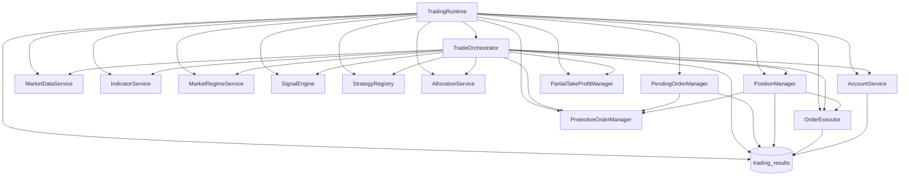
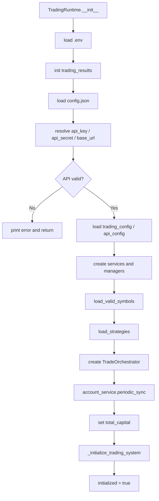
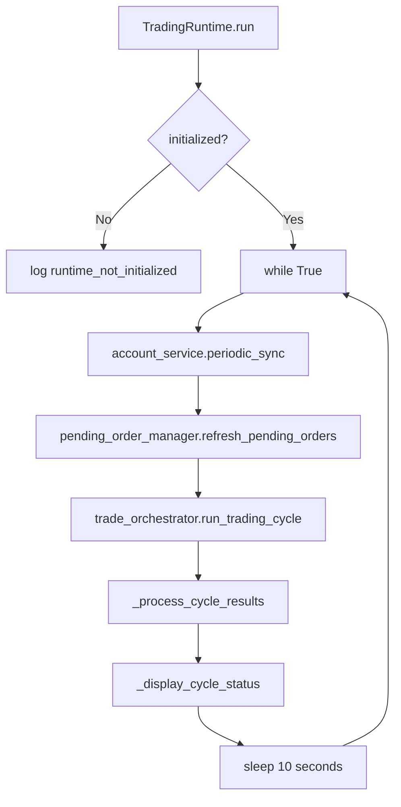
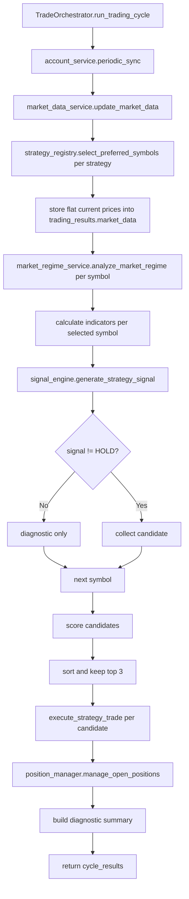
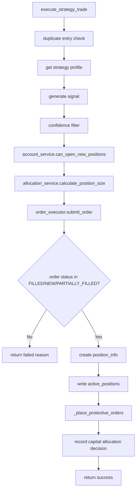
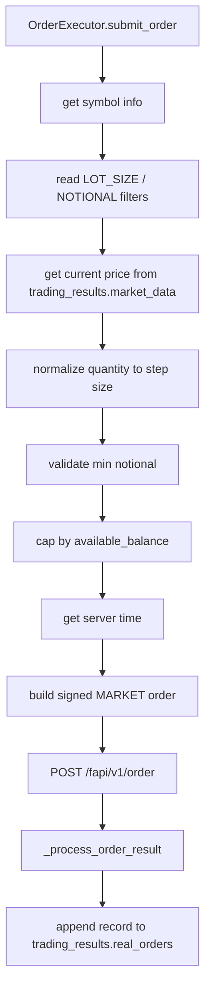
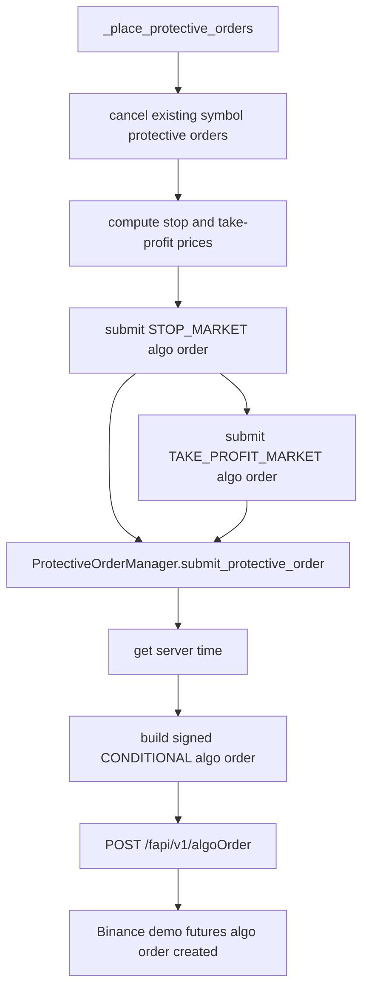
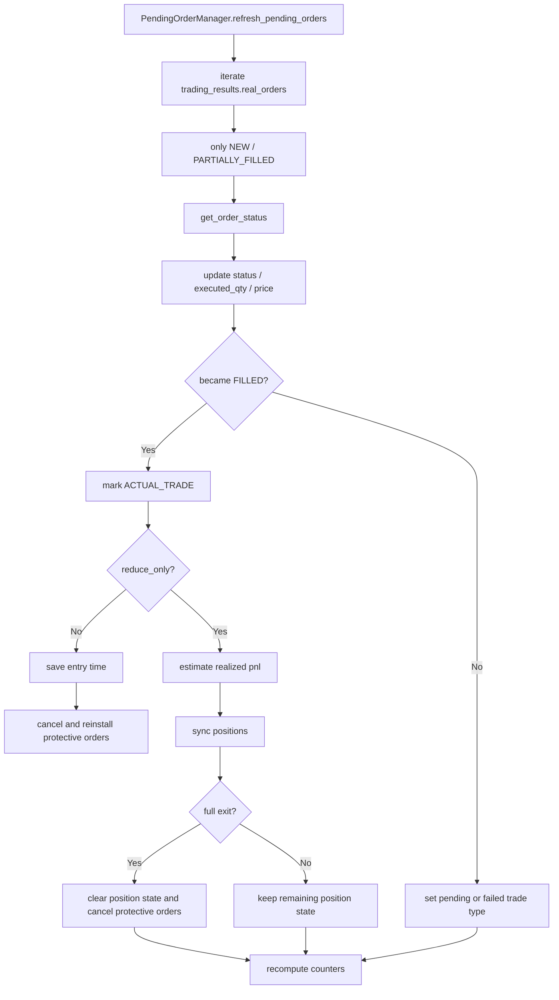
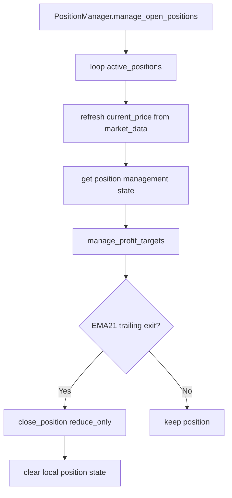

# Main Runtime Logic Flowchart

Date: 2026-04-09
Target: `main_runtime.py` centered runtime flow

## 1. Big Picture

This runtime is organized around one central object:

- `TradingRuntime`

It owns shared state:

- `trading_results`

And wires together these main services:

- `AccountService`
- `MarketDataService`
- `IndicatorService`
- `MarketRegimeService`
- `SignalEngine`
- `StrategyRegistry`
- `AllocationService`
- `OrderExecutor`
- `ProtectiveOrderManager`
- `PendingOrderManager`
- `PositionManager`
- `TradeOrchestrator`

## 2. Runtime Dependency Map

## 3. Initialization Flow

## 4. Main Loop Flow

## 5. Trading Cycle Flow

## 6. Trade Execution Flow

## 7. Order Path

## 8. Protective Order Path

## 9. Pending Order Refresh Path

## 10. Position Management Path

## 11. Shared State Connections

These are the most important shared structures inside `trading_results`:

- `active_positions`
  Used by `TradeOrchestrator`, `AccountService`, `PositionManager`, `PendingOrderManager`
- `real_orders`
  Produced by `OrderExecutor`, consumed by `PendingOrderManager`
- `pending_trades`
  Recomputed by `PendingOrderManager`
- `closed_trades`
  Recomputed by `PendingOrderManager`
- `market_data`
  Written by `TradeOrchestrator`, read by `OrderExecutor`
- `system_errors`
  Written through `TradingRuntime.log_system_error`
- `position_entry_times`
  Intended to connect runtime, pending fills, and position management

## 12. Practical Reading Order

If you want to understand the code quickly, read in this order:

1. [main_runtime.py](/c:/next-trade-ver1.0/main_runtime.py)
2. [core/trade_orchestrator.py](/c:/next-trade-ver1.0/core/trade_orchestrator.py)
3. [core/order_executor.py](/c:/next-trade-ver1.0/core/order_executor.py)
4. [core/protective_order_manager.py](/c:/next-trade-ver1.0/core/protective_order_manager.py)
5. [core/pending_order_manager.py](/c:/next-trade-ver1.0/core/pending_order_manager.py)
6. [core/position_manager.py](/c:/next-trade-ver1.0/core/position_manager.py)
7. [core/account_service.py](/c:/next-trade-ver1.0/core/account_service.py)

## 13. Connection Notes

### A. `position_entry_times` is now unified

In [main_runtime.py](/c:/next-trade-ver1.0/main_runtime.py), `PendingOrderManager` now receives the same shared mapping stored in `trading_results["position_entry_times"]`.

That means:

- `TradingRuntime`
- `PendingOrderManager`
- `PositionManager`

now all refer to the same position entry time state.

### B. `update_stop_loss()` is aligned to algo orders

In [core/protective_order_manager.py](/c:/next-trade-ver1.0/core/protective_order_manager.py), `update_stop_loss()` now reads algo-order fields using:

- `orderType`
- `algoId`

and also keeps `managed_stop_prices` synchronized both in the manager object and in `trading_results["managed_stop_prices"]`.

This brings the stop-tightening branch into the same state model as the validated protective order path.

## 14. One-Line Summary

The runtime flow is:

`TradingRuntime` syncs account -> refreshes pending orders -> `TradeOrchestrator` pulls market data and signals -> `OrderExecutor` places entry/exit orders -> `ProtectiveOrderManager` installs algo stop/take-profit orders -> `PendingOrderManager` reconciles fills -> `PositionManager` manages open positions.
