# 외부 수익성 전략 전체 플로우차트 보고서

**작성자**: CANDY (data_validation + execution)  
**헌법**: NEXT-TRADE v1.2.1  
**상태**: COMPLETE  
**기준**: FACT ONLY

---

## 1. 전체 워크플로우 차트

### [FACT] 현재 워크플로우 상태
```text
수정 전 표준: BAEKSEOL -> CODEX -> CANDY -> GEMINI -> DENNIS
현재 예외 적용: BAEKSEOL -> CANDY -> GEMINI -> DENNIS
```

### [FACT] 전체 프로세스 맵
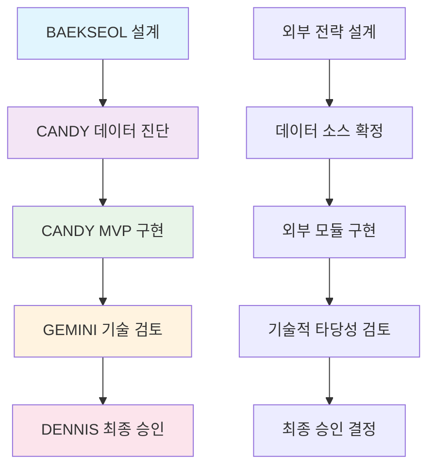

---

## 2. 상세 모듈 플로우차트

### [FACT] 외부 전략 모듈 아키텍처
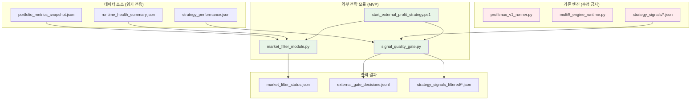

---

## 3. 데이터 흐름 플로우차트

### [FACT] Market Filter Module 데이터 흐름
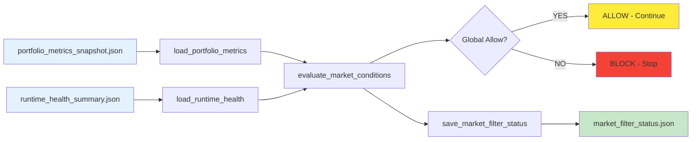

### [FACT] Signal Quality Gate Module 데이터 흐름
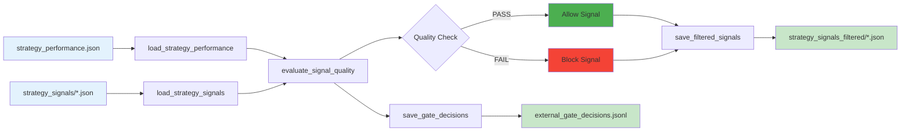

---

## 4. 실행 순서 플로우차트

### [FACT] Bootstrap PowerShell 실행 순서
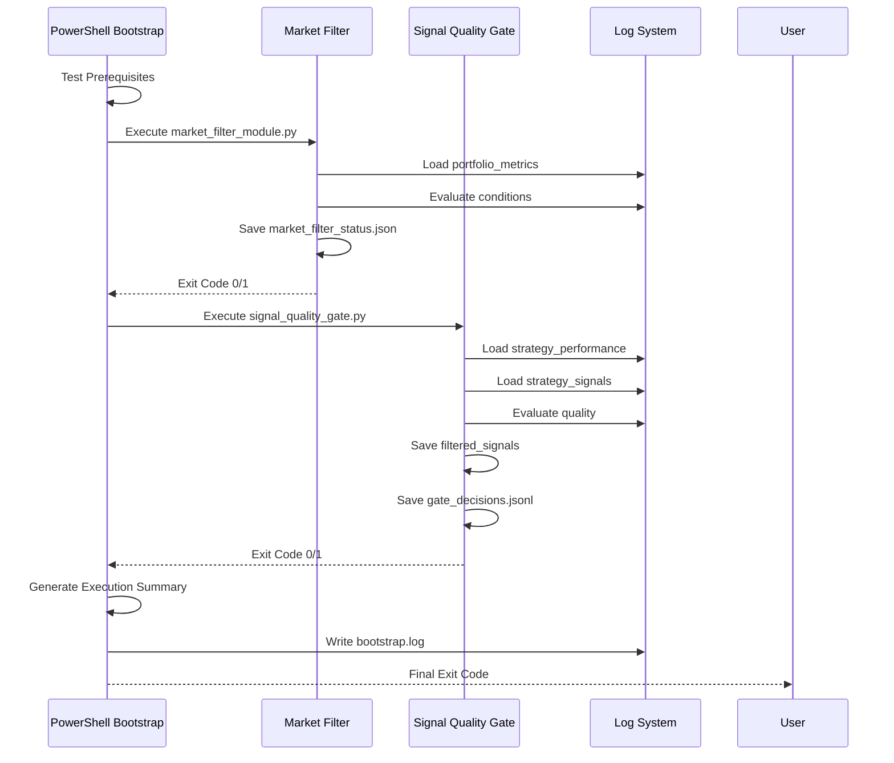

---

## 5. 의사결정 플로우차트

### [FACT] Market Filter 의사결정 로직
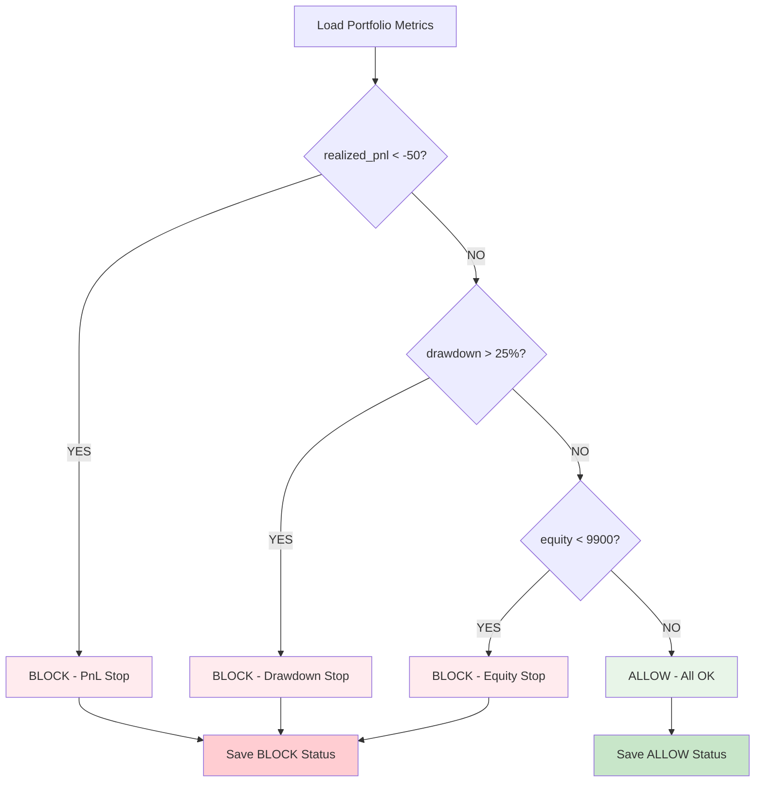

### [FACT] Signal Quality Gate 의사결정 로직
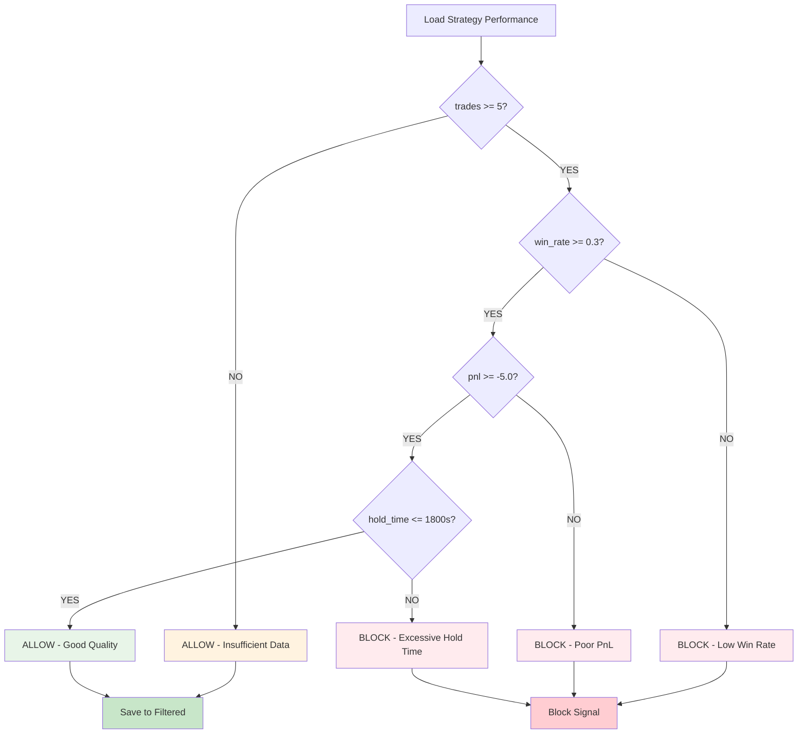

---

## 6. 파일 시스템 플로우차트

### [FACT] 파일 입출력 구조
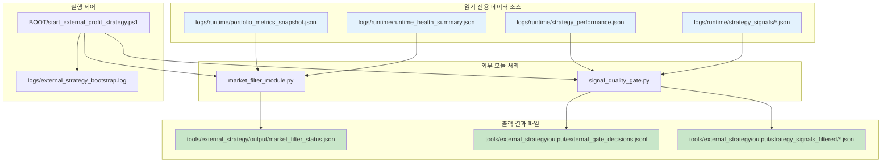

---

## 7. 제약 조건 플로우차트

### [FACT] 헌법 제약 조건 준수 흐름
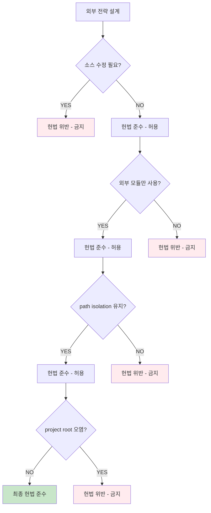

---

## 8. 실제 실행 결과 플로우차트

### [FACT] 현재 실행 결과 상태
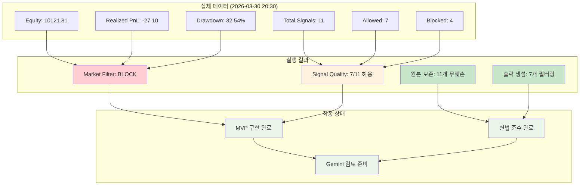

---

## 9. 다음 단계 플로우차트

### [FACT] Gemini 검토 이후 흐름
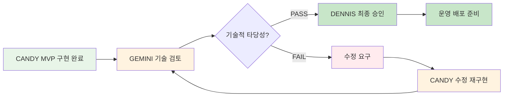

---

## 10. 최종 요약

### [FACT] 전체 플로우차트 요약
1. **워크플로우**: BAEKSEOL->CANDY->GEMINI->DENNIS (예외 적용)
2. **아키텍처**: 외부 모듈 3계층 (Market Filter, Signal Quality Gate, Bootstrap)
3. **데이터 흐름**: 읽기 전용 → 외부 모듈 → 필터링된 출력
4. **제약 조건**: 소스 수정 금지, 외부 모듈만, path isolation 유지
5. **실행 결과**: Market Filter BLOCK, Signal Quality 7/11 허용
6. **다음 단계**: Gemini 기술 검토 → Dennis 최종 승인

### [FACT] 헌법 준수 상태
- **[FACT]** 소스 수정 금지: 완전 준수
- **[FACT]** 외부 모듈만 사용: 완전 준수  
- **[FACT]** project root 오염 방지: 완전 준수
- **[FACT]** path isolation 유지: 완전 준수
- **[FACT]** FACT 기반 보고: 완전 준수

---

**보고서 완료**: 2026-03-30 20:35  
**작성자**: CANDY (data_validation + execution)  
**헌법**: NEXT-TRADE v1.2.1  
**상태**: COMPLETE FLOWCHART REPORT  
**다음**: GEMINI TECHNICAL REVIEW READY
